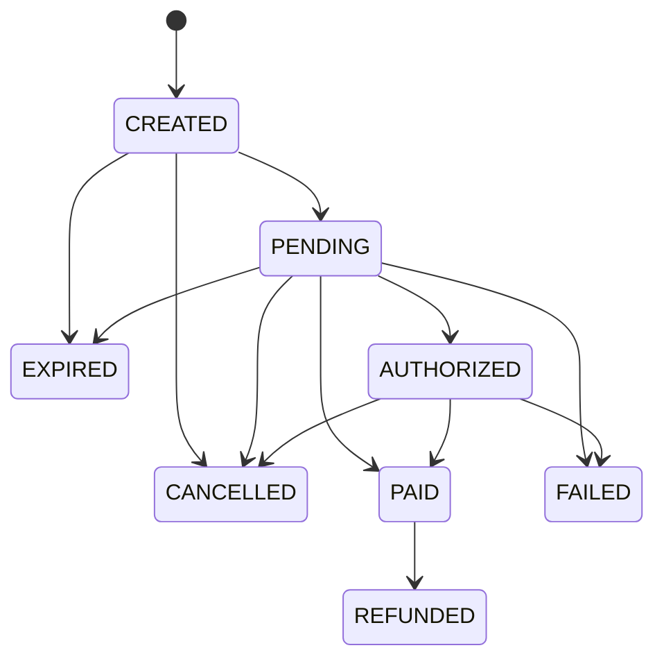

# Payment Gateway

An educational payment gateway backend demonstrating payment lifecycle, idempotency, signed webhooks, refunds, and reconciliation. This is a portfolio project and does not process real card data. Never submit real card numbers, CVV, or sensitive payment credentials.

## Architecture

Pragmatic hexagonal architecture separates domain, application ports, infrastructure adapters, and HTTP interfaces. PostgreSQL is the source of truth and `pgx` provides the bounded connection pool. See [architecture](docs/architecture.md), [database design](docs/database.md), and [architecture decisions](docs/adr/).

## Implemented baseline

- Go HTTP service with process health and database readiness endpoints
- PostgreSQL schema migrations applied transactionally at startup
- Payment lifecycle transition rules, refund amount checks, and merchant-scoped idempotency request hashing
- `PaymentProvider` port and deterministic `MockPaymentProvider` adapter, with no card-data fields
- HMAC-SHA256 webhook signature verifier with constant-time comparison and timestamp tolerance
- Docker Compose and GitHub Actions CI with PostgreSQL migration integration tests

The payment creation, webhook persistence/processing, refund, and reconciliation HTTP workflows are still in progress.

## Tech stack

Go 1.23, PostgreSQL 16, Docker Compose, GitHub Actions. Redis is not included yet; database constraints provide durable idempotency and PostgreSQL supports this initial scope.

## State machine



## ERD

See [docs/erd.md](docs/erd.md) for the Mermaid entity relationship diagram.

## Local setup

```sh
cp .env.example .env
docker compose up --build
# in another terminal
curl -i http://localhost:8081/healthz
curl -i http://localhost:8081/readyz
```

Compose credentials are for local development only. Do not reuse them outside local development.

## Environment variables

| Variable | Purpose | Default |
| --- | --- | --- |
| `HTTP_ADDR` | HTTP listen address in the container | `:8081` |
| `HTTP_PORT` | Host API port | `8081` |
| `POSTGRES_PORT` | Host PostgreSQL port | `5433` |
| `DATABASE_URL` | Required PostgreSQL connection | Local Compose database |

## Migrations

The service applies pending ordered `.up.sql` files from `migrations/` at startup. See [migration instructions](migrations/README.md) and [database design](docs/database.md).

## API and OpenAPI

```sh
curl -i http://localhost:8081/healthz
curl -i http://localhost:8081/readyz
```

See [docs/api.md](docs/api.md) and the [OpenAPI contract](docs/openapi.yaml).

## Testing

```sh
go test ./...
go vet ./...
go build ./...
```

Unit tests run without a database. Set `TEST_DATABASE_URL` to run PostgreSQL migration integration tests. CI runs both unit and integration tests.

## Idempotency and webhook security

Payment creation request bodies are hashed for same-key/different-request conflict detection. PostgreSQL enforces uniqueness by `(merchant_id, idempotency_key)`. Webhook signatures cover the timestamp and exact raw body; timestamp tolerance limits replay windows, while a database uniqueness constraint will deduplicate provider event IDs during processing.

## Refund and reconciliation

Refund totals are checked against the captured amount by domain rules. The persistence workflow, provider calls, and reconciliation jobs are planned implementation steps.

## Security considerations

The schema has no card number or CVV columns. Payment methods store provider references and safe display labels only. Merchant API key hashes can be verified without storing raw keys; webhook secrets must be encrypted at rest because signature verification requires the original secret. Keep encryption keys and any provider credentials in deployment secret storage.

## Future improvements

Implement merchant authentication, transactional idempotent payment creation, durable webhook retries, refunds, reconciliation jobs, rate limiting, and operational metrics and tracing.
