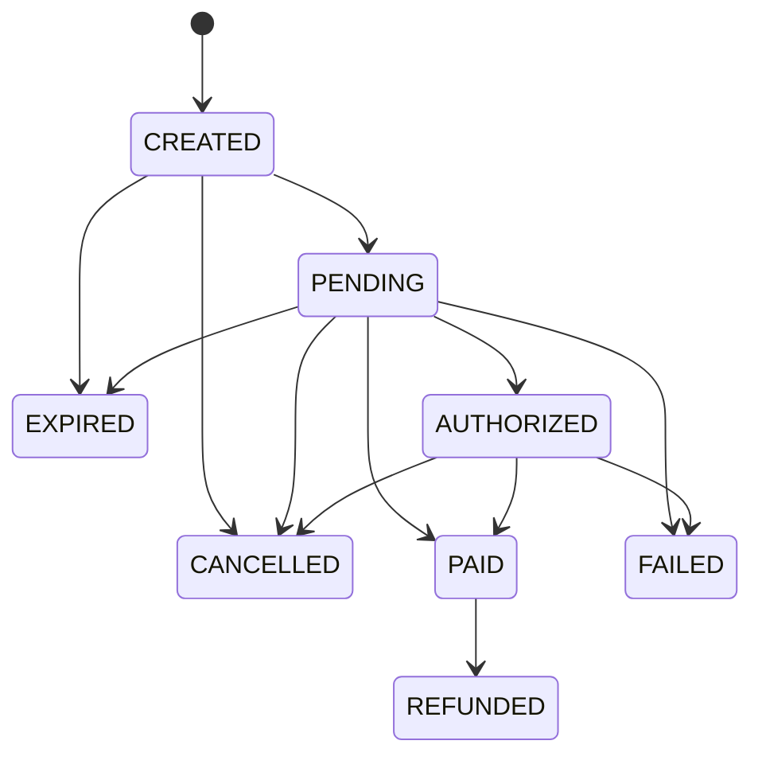

# Payment Gateway

An educational payment gateway backend demonstrating payment lifecycle, idempotency, signed webhooks, refunds, and reconciliation. This is a portfolio project and does not process real card data. Never submit real card numbers, CVV, or sensitive payment credentials.

## Architecture

Pragmatic hexagonal architecture separates domain, application ports, infrastructure adapters, and HTTP interfaces. PostgreSQL is the source of truth and `pgx` provides the bounded connection pool. See [architecture](docs/architecture.md), [database design](docs/database.md), and [architecture decisions](docs/adr/).

## Implemented baseline

- Go HTTP service with process health and database readiness endpoints
- PostgreSQL schema migrations applied transactionally at startup
- Merchant API key generation and authentication; idempotent payment-intent creation; payment lifecycle transition rules and refund amount checks
- Idempotent payment attempt execution with persisted provider authorization and stable provider retry keys
- `PaymentProvider` port and deterministic `MockPaymentProvider` adapter, with no card-data fields
- HMAC-SHA256 webhook signature verifier with constant-time comparison and timestamp tolerance
- Signed webhook intake with encrypted merchant secrets, persistent event deduplication, and transactional payment state updates
- Batch reconciliation for stale pending attempts against the provider's stable idempotency reference
- Merchant-scoped partial/full refund API with idempotency, locked refund reservations, mock provider refunds, and audit records
- Merchant-scoped payment status lookup with per-operation rate limiting
- Docker Compose and GitHub Actions CI with PostgreSQL migration integration tests

Payment attempts return `AUTHORIZED`; refunds require a `PAID` intent from a provider event. The mock adapters return deterministic references and do not process real transactions. See [ADR 004](docs/adr/004-idempotent-payment-attempts.md) for retry behavior, [ADR 006](docs/adr/006-payment-reconciliation.md) for reconciliation, and [ADR 007](docs/adr/007-rate-limiting.md) for API rate limits.

## Tech stack

Go 1.23, PostgreSQL 16, Docker Compose, GitHub Actions. Redis is not included yet; database constraints provide durable idempotency and PostgreSQL supports this initial scope.

## State machine



## ERD

See [docs/erd.md](docs/erd.md) for the Mermaid entity relationship diagram.
Refund persistence and retry behavior are shown in [docs/sequence-refund.md](docs/sequence-refund.md) and [ADR 003](docs/adr/003-refund-reservations.md).

## Local setup

```sh
cp .env.example .env
docker compose up --build
# in another terminal
curl -i http://localhost:8081/healthz
curl -i http://localhost:8081/readyz
```

Compose credentials are for local development only. Do not reuse them outside local development.

## Environment variables

| Variable | Purpose | Default |
| --- | --- | --- |
| `HTTP_ADDR` | HTTP listen address in the container | `:8081` |
| `HTTP_PORT` | Host API port | `8081` |
| `POSTGRES_PORT` | Host PostgreSQL port | `5433` |
| `DATABASE_URL` | Required PostgreSQL connection | Local Compose database |
| `WEBHOOK_ENCRYPTION_KEY` | Base64 encoded 32 byte key used to encrypt merchant webhook secrets | Local development key in `.env.example` |
| `RECONCILIATION_OLDER_THAN` | Minimum age for pending attempts selected by reconciliation | `5m` |
| `RECONCILIATION_BATCH_SIZE` | Maximum attempts per reconciliation run | `100` |
| `RATE_LIMIT_REQUESTS` | Requests per merchant and endpoint scope in each window | `60` |
| `RATE_LIMIT_WINDOW` | Fixed rate-limit window as a Go duration | `1m` |

## Migrations

The service applies pending ordered `.up.sql` files from `migrations/` at startup. See [migration instructions](migrations/README.md) and [database design](docs/database.md).

## API and OpenAPI

```sh
curl -i http://localhost:8081/healthz
curl -i http://localhost:8081/readyz
```

See [docs/api.md](docs/api.md) and the [OpenAPI contract](docs/openapi.yaml). Create intents with a merchant bearer key and an `Idempotency-Key`; the example contains no card data.

## Testing

```sh
go test ./...
go vet ./...
go build ./...
```

Unit tests run without a database. Set `TEST_DATABASE_URL` to run PostgreSQL migration integration tests. CI runs both unit and integration tests.

## Idempotency and webhook security

Payment creation request bodies are hashed for same-key/different-request conflict detection. PostgreSQL enforces uniqueness by `(merchant_id, idempotency_key)`. Webhook signatures use `Payment-Signature: t=<unix>,v1=<hex>` over the timestamp, a period, and exact raw body; timestamp tolerance is five minutes. `POST /v1/webhooks/{merchantID}/{provider}` accepts only `payment.paid` and `payment.failed` events with `id`, `type`, and `payment_reference`. Extra fields are rejected, and only those allow-listed fields are persisted. The event ID uniqueness constraint deduplicates deliveries; event record, payment status changes, and audit entry commit together. Failed transaction attempts roll back and can be retried by the provider.

Create a merchant once with `MERCHANT_NAME="Demo" DATABASE_URL=... WEBHOOK_ENCRYPTION_KEY=... go run ./cmd/create-merchant`. The command prints the API key and webhook signing secret once; save them securely. Webhook secrets are encrypted with AES-256-GCM at rest. Generate a random 32-byte key for each deployment, encode it with base64, and store it in the deployment's secret manager. The checked-in key is only for local Compose development.

## Refund and reconciliation

Refund totals include pending and succeeded reservations and are checked while locking the payment intent, preventing concurrent over-refunds. Refund idempotency is scoped to a payment intent; the provider receives a stable derived key so retries after a timeout do not create duplicate refunds.

Run `DATABASE_URL=... go run ./cmd/reconcile` as a scheduled one-shot job. It selects stale `PENDING` attempts for the configured provider, looks each up by its stable attempt idempotency key, and transactionally applies recognized provider statuses with an audit record. Rows changed by a webhook or another reconciliation worker are rechecked under lock. The mock provider demonstrates recovery after a lost authorization response; it does not model real settlement or capture.

## Security considerations

The schema has no card number or CVV columns. Payment methods store provider references and safe display labels only. Merchant API key hashes can be verified without storing raw keys; webhook secrets must be encrypted at rest because signature verification requires the original secret. Keep encryption keys and any provider credentials in deployment secret storage.

Authenticated merchant endpoints use a PostgreSQL fixed-window counter, scoped by merchant and operation. Signed webhooks consume quota only after signature verification. Requests over quota receive `429 Too Many Requests` with `Retry-After`; if PostgreSQL cannot enforce the limit, the API fails closed with `503`.

## Future improvements

Implement merchant authentication, transactional idempotent payment creation, durable webhook retries, refunds, reconciliation jobs, rate limiting, and operational metrics and tracing.
