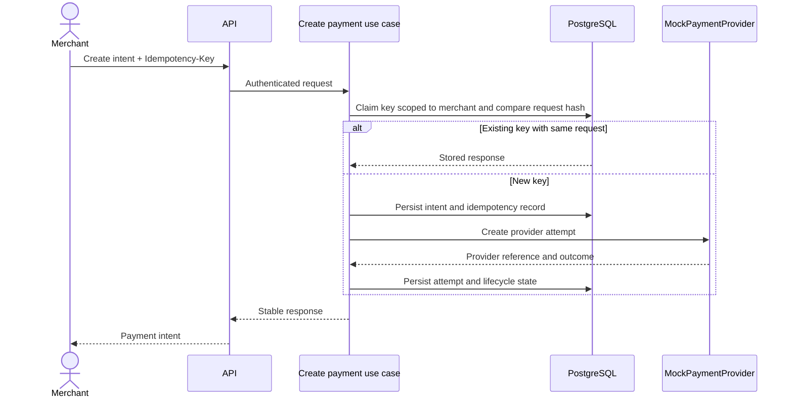

# Payment creation sequence (planned)

```mermaid
sequenceDiagram
  actor Merchant
  participant API
  participant UseCase as Create payment use case
  participant DB as PostgreSQL
  participant Provider as MockPaymentProvider
  Merchant->>API: Create intent + Idempotency-Key
  API->>UseCase: Authenticated request
  UseCase->>DB: Claim key scoped to merchant and compare request hash
  alt Existing key with same request
    DB-->>UseCase: Stored response
  else New key
    UseCase->>DB: Persist intent and idempotency record
    UseCase->>Provider: Create provider attempt
    Provider-->>UseCase: Provider reference and outcome
    UseCase->>DB: Persist attempt and lifecycle state
  end
  UseCase-->>API: Stable response
  API-->>Merchant: Payment intent
```
