# Payment intent and attempt sequence

```mermaid
sequenceDiagram
  actor Merchant
  participant API
  participant UseCase as Payment application
  participant DB as PostgreSQL
  participant Provider as MockPaymentProvider
  Merchant->>API: POST payment intent + Idempotency-Key
  API->>UseCase: Authenticate and validate request
  UseCase->>DB: Atomically persist intent and replay response
  DB-->>API: Stable payment intent response
  Merchant->>API: POST attempt + Idempotency-Key
  API->>UseCase: Authenticated attempt request
  UseCase->>DB: Lock intent and reserve PENDING attempt
  UseCase->>Provider: CreatePayment with stable attempt key
  Provider-->>UseCase: AUTHORIZED + provider reference
  UseCase->>DB: Persist authorization and audit record
  API-->>Merchant: Authorized attempt
```

An authorization is not a capture. A verified provider event will move the intent and attempt to `PAID` in the webhook processing flow.

Stale attempts left at `PENDING` after a provider timeout are checked by the scheduled reconciliation job. It queries the provider using the same stable attempt key, then locks and updates both the attempt and intent with an audit record.
