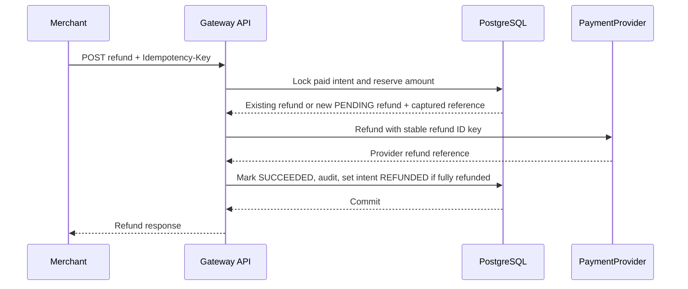

# Refund sequence

The payment intent row lock serializes refund reservations. Pending reservations count against the remaining captured amount, so a provider timeout followed by a retry cannot allow a second request to reserve the same funds.
