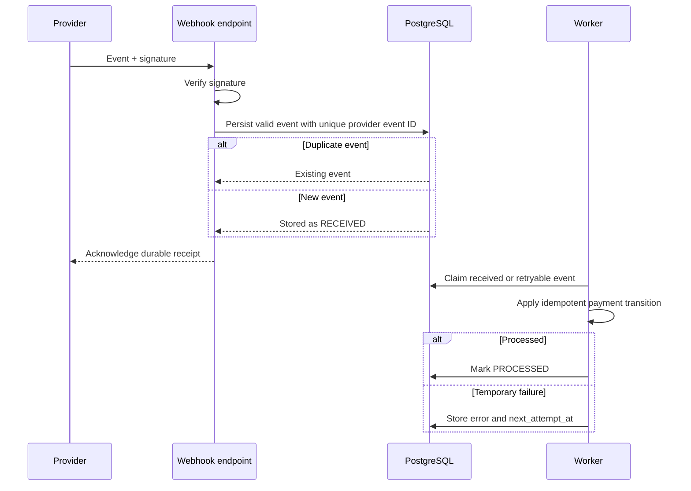

# Webhook processing sequence (planned)

```mermaid
sequenceDiagram
  participant Provider
  participant API as Webhook endpoint
  participant DB as PostgreSQL
  participant Worker
  Provider->>API: Event + signature
  API->>API: Verify signature
  API->>DB: Persist valid event with unique provider event ID
  alt Duplicate event
    DB-->>API: Existing event
  else New event
    DB-->>API: Stored as RECEIVED
  end
  API-->>Provider: Acknowledge durable receipt
  Worker->>DB: Claim received or retryable event
  Worker->>Worker: Apply idempotent payment transition
  alt Processed
    Worker->>DB: Mark PROCESSED
  else Temporary failure
    Worker->>DB: Store error and next_attempt_at
  end
```
